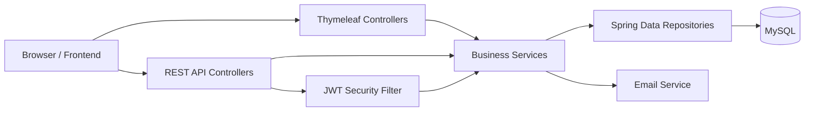

# Film Management Platform

A layered Spring Boot application for managing films, actors, and categories with a secure authentication flow, token-based access control, email confirmation, and a server-rendered web UI. The project combines REST endpoints and Thymeleaf views to deliver a complete catalog management experience built for maintainability, scalability, and clean code.

## Key Features

- Film catalog management with create, read, update, delete, search, sort, and pagination support.
- Category management with safeguards that prevent deleting categories still linked to films.
- Actor management with many-to-many relationships between films and performers.
- Stateless authentication using JWT bearer tokens and role-based authorization.
- Email-based account confirmation before login is enabled.
- REST API and MVC web layer sharing the same service and persistence layer.
- Image upload support for film posters stored under the application static assets.
- OpenAPI / Swagger UI documentation for API exploration.
- Tailwind CSS frontend pipeline for utility-first styling.
- Docker Compose environment for local MySQL and phpMyAdmin provisioning.

## Architecture Overview

This repository follows a layered monolith architecture with clear separation of concerns:

- Presentation layer: Thymeleaf controllers and REST controllers.
- Application layer: service classes that encapsulate business rules.
- Persistence layer: Spring Data JPA repositories backed by MySQL.
- Security layer: JWT filter, password encoding, role checks, and stateless session handling.
- Integration layer: email delivery for account confirmation and OpenAPI for API discovery.

The domain model centers on three main entities:

- `Film` belongs to one `Category` and can be linked to many `Acteur` records.
- `User` accounts are stored separately from business data and are activated through a confirmation token.
- `Session` records persist confirmation and authentication tokens so logout and validation can be enforced server-side.



## Technology Stack

### Backend

- Java 17
- Spring Boot 3.2.1
- Spring Web
- Spring Data JPA
- Spring Security
- JWT with `jjwt`
- Spring Mail
- SpringDoc OpenAPI / Swagger UI
- Lombok
- MySQL Connector/J

### Frontend

- Thymeleaf server-side rendering
- Tailwind CSS
- PostCSS / Autoprefixer

### AI / LLM

- None currently implemented in this repository.

### DevOps and Tooling

- Maven Wrapper
- Docker Compose
- MySQL 8
- phpMyAdmin
- Node.js for Tailwind asset compilation
- Python seeding script with `mysql-connector-python` and `faker`

## Core Capabilities

### Web application flows

- Browse the home page and paginated film listings.
- Search films by keyword and filter by category.
- View film details and category-specific film collections.
- Add, edit, and delete films and actors through protected admin views.
- Upload and replace film poster images.

### API flows

- Register a user account and receive a confirmation email.
- Confirm the account using the emailed token.
- Authenticate with a JWT bearer token.
- Read film data through `/api/films`.
- Access the authenticated profile through `/api/profile`.

### Database behavior

- MySQL is used as the primary datastore.
- JPA auto-updates the schema in development.
- Film titles are unique.
- Token sessions are persisted to support confirmation and logout flows.

## Getting Started

### Prerequisites

- Java 17
- Maven 3.9+ or the included Maven Wrapper
- Node.js 18+ for the Tailwind build scripts
- Docker and Docker Compose for local MySQL provisioning
- Python 3.10+ only if you plan to run the optional database seeding script

### Installation

1. Clone the repository.
2. Start the database services:

```bash
docker compose up -d
```

3. Install frontend dependencies and build the CSS bundle:

```bash
npm install
npm run build
```

4. Review `src/main/resources/application.yml` and set the following values for your environment:

- `spring.datasource.username`
- `spring.datasource.password`
- `spring.mail.username`
- `spring.mail.password`
- `security.token.secret` as a Base64-encoded signing key

5. Start the Spring Boot application:

```bash
./mvnw spring-boot:run
```

### Environment Configuration

The application is configured for local development with:

- MySQL on `localhost:3306`
- Application port `8085`
- phpMyAdmin on `http://localhost:8081`

If you use different credentials or hostnames, update `src/main/resources/application.yml` accordingly.

### Optional Seed Data

The repository includes a helper script that populates sample categories, actors, and films:

```bash
pip install mysql-connector-python faker
python seed_database.py
```

## Deployment and Run Modes

### Local development

```bash
docker compose up -d
npm run build
./mvnw spring-boot:run
```

### Build only

```bash
./mvnw clean package
```

### Database inspection

- MySQL: `localhost:3306`
- phpMyAdmin: `http://localhost:8081`

## API / Usage Examples

### Register a new user

```bash
curl -X POST http://localhost:8085/auth/register \
	-d "name=Ahmed Benali" \
	-d "email=ahmed@example.com" \
	-d "password=Pass123"
```

### Confirm the account

```bash
curl "http://localhost:8085/auth/validate?token=YOUR_CONFIRMATION_TOKEN"
```

### Authenticate and call the API

```bash
curl -H "Authorization: Bearer YOUR_JWT_TOKEN" \
	http://localhost:8085/api/films
```

### Add a film with poster upload

```bash
curl -X POST http://localhost:8085/api/films/add \
	-H "Authorization: Bearer YOUR_JWT_TOKEN" \
	-F "titre=Inception" \
	-F "description=Dream-sharing thriller" \
	-F "annee=2010" \
	-F "idCategorie=1" \
	-F "idActeurs=1" \
	-F "image=@./poster.jpg"
```

### Update a film

```bash
curl -X PUT http://localhost:8085/api/films/update \
	-H "Authorization: Bearer YOUR_JWT_TOKEN" \
	-F "id=1" \
	-F "titre=Inception" \
	-F "description=Updated description" \
	-F "annee=2010" \
	-F "idCategorie=1"
```

## Security Model

- Authentication is stateless and token-based.
- Passwords are encoded with BCrypt.
- Admin-only endpoints are protected with role checks.
- Confirmation tokens are validated against the persisted session table before account activation.
- Swagger UI is configured to accept a bearer token for secured API exploration.

## Project Notes

- There is no MQTT, Kafka, or other event-streaming integration in the current codebase.
- There is no AI / LLM agent layer in the current codebase.
- The app is optimized for a classic modular monolith rather than microservices.

## Repository Layout

```text
src/main/java/tp1/film/
	Config/          Security, mail, JWT, and Swagger configuration
	Controlller/     MVC and REST controllers
	Dto/             Request payload models
	Entity/          JPA entities
	Repository/      Spring Data repositories
	Services/        Business logic and service implementations
	utils/           Token and image helpers
src/main/resources/
	templates/       Thymeleaf views
	static/          CSS and uploaded photos
docker-compose.yml MySQL and phpMyAdmin local stack
seed_database.py   Optional sample data generator
```

## License

No license has been specified yet. Add one before publishing the repository publicly.
